# Project 3

Multimodal 3D Perception
for Bird's-Eye View (BEV) Occupancy Prediction

<div align="center">

[]()
[]()
[]()
[]()
[]()
[]()
[]()

</div>

## 1. Overview

### Purpose

Project 3 develops a **multimodal 3D perception system** for **BEV occupancy prediction** using synchronized **RGB camera**, **LiDAR**, and **IMU** measurements from the **nuScenes-mini** dataset.

Starting from two unimodal baselines (**RGB Baseline** and **LiDAR BEV Baseline**), the project progressively investigates increasingly sophisticated multimodal perception architectures, including **Multimodal Fusion**, **Multimodal Fusion + CBAM**, **Multimodal Cross-Attention Fusion**, and **Multimodal Hybrid Cross-Attention**.

Beyond perception accuracy, the project emphasizes **engineering and deployment readiness** through latency profiling, throughput benchmarking, GPU memory analysis, robustness evaluation, and model export using **TorchScript** and **ONNX**. The overall objective is to demonstrate how complementary sensor modalities improve spatial understanding while balancing prediction accuracy, computational efficiency, robustness, and deployability for real-world autonomous driving systems.

---

### Highlights

- **Multimodal perception** using synchronized RGB camera, LiDAR, and IMU data
- **BEV occupancy prediction** for autonomous scene understanding
- **Progressive architecture development** from unimodal baselines to advanced multimodal fusion models
- **Four multimodal fusion architectures**, including:
  - Multimodal Fusion
  - Multimodal Fusion + CBAM
  - Multimodal Cross-Attention Fusion
  - Multimodal Hybrid Cross-Attention
- **Comprehensive quantitative evaluation** using:
  - IoU, Precision, Recall, and F1-score
  - Latency, FPS, Throughput, and GPU memory usage
- **Robustness benchmarking** under simulated sensor degradations and modality dropout
- **Deployment engineering** with TorchScript, ONNX, and inference benchmarking

---

### Project Evolution

```text
RGB Baseline
        │
        ▼
LiDAR BEV Baseline
        │
        ▼
Multimodal Fusion
        │
        ▼
Multimodal Fusion + CBAM
        │
        ▼
Multimodal Cross-Attention Fusion
        │
        ▼
Multimodal Hybrid Cross-Attention
        │
        ▼
Deployment & Engineering
```

Each phase introduces a single architectural improvement while preserving a consistent training and evaluation pipeline, enabling systematic comparison of perception accuracy, robustness, computational efficiency, and deployment characteristics.

---

## Executive Summary

This project presents a multimodal BEV occupancy prediction system using synchronized RGB camera, LiDAR, and IMU measurements from the **nuScenes-mini** dataset.

Key contributions include:

- Progressive development of four multimodal fusion architectures
- Attention-guided multimodal perception using CBAM and cross-attention
- Quantitative evaluation using IoU, Precision, Recall, and F1-score
- Robustness benchmarking under five simulated sensor perturbations plus a clean baseline
- Qualitative failure analysis using automatically selected worst-case examples
- Deployment benchmarking, including latency, throughput, GPU memory usage, and model size
- Production-oriented model export with TorchScript and ONNX

The project emphasizes both perception accuracy and practical engineering considerations, demonstrating an end-to-end workflow from multimodal model development through quantitative evaluation, robustness analysis, and deployment optimization.

---

## Contents

1. Overview
2. Motivation
3. Dataset
4. Repository Structure
5. System & Model Architectures
6. Training
7. Evaluation
8. Results
9. Ablation Studies
10. Robustness & Failure Analysis
11. Deployment & Engineering
12. Future Work
13. Key Takeaways

---

## Project at a Glance

| Item | Value |
|------|-------|
| Domain | Multimodal 3D Perception |
| Task | BEV Occupancy Prediction |
| Dataset | nuScenes-mini |
| Modalities | RGB + LiDAR + IMU |
| Framework | PyTorch |
| Best Model | Multimodal Fusion |
| Primary Metric | IoU |
| Deployment | TorchScript + ONNX |

---

## 2. Motivation

Modern autonomous driving systems operate in complex, dynamic environments where no single sensor remains reliable under all conditions. RGB cameras provide rich semantic information but are sensitive to illumination changes and adverse weather. LiDAR provides accurate geometric measurements but contains relatively limited appearance information. IMU sensors measure vehicle motion but cannot directly observe the surrounding environment.

This project investigates how **multimodal sensor fusion** combines these complementary sensing modalities to produce a more accurate, robust, and deployment-ready BEV perception system.

---

### Why RGB Alone Is Insufficient

RGB cameras capture rich visual appearance and semantic information, making them well suited for recognizing roads, vehicles, lane markings, traffic signs, and surrounding infrastructure. However, camera-only perception has several limitations:

- Sensitive to illumination changes (night, shadows, glare)
- Performance degrades under adverse weather (rain, fog, snow)
- Limited depth and geometric understanding
- Vulnerable to occlusions and motion blur

As a result, RGB-only perception often struggles to accurately estimate the spatial occupancy of the surrounding environment.

---

### Why LiDAR Helps

LiDAR directly measures the three-dimensional geometry of the environment using laser ranging. After projection into a BEV representation, it provides accurate spatial information that complements RGB imagery.

Key advantages include:

- Accurate distance estimation
- Reliable geometric structure
- Robustness to lighting conditions
- Precise localization of occupied space

Although LiDAR provides highly accurate geometric information, it contains relatively limited semantic appearance information.

---

### Why IMU Helps

The Inertial Measurement Unit (IMU) measures vehicle motion through linear acceleration and angular velocity.

Although IMU does not directly observe the surrounding environment, it provides valuable motion information that complements both RGB and LiDAR measurements.

IMU contributes:

- Ego-motion information
- Motion context for multimodal fusion
- Complementary inertial features

---

### Why Multimodal Fusion Matters

Each sensing modality contributes complementary information.

| Sensor | Primary Information | Strengths | Limitations |
|---------|---------------------|-----------|-------------|
| **RGB Camera** | Appearance & semantics | Rich visual context | Limited geometry; sensitive to lighting |
| **LiDAR** | 3D geometry | Accurate spatial structure | Limited semantic appearance information |
| **IMU** | Vehicle motion | Ego-motion estimation | No direct environmental observation |

By integrating these complementary modalities, the perception system learns richer feature representations than any individual sensor alone. Throughout this project, progressively more sophisticated multimodal architectures are investigated—from **Multimodal Fusion** to **Multimodal Fusion + CBAM**, **Multimodal Cross-Attention Fusion**, and **Multimodal Hybrid Cross-Attention**—to improve BEV occupancy prediction while maintaining computational efficiency and deployment readiness.

---

### Multimodal Perception Pipeline

<p align="center">
  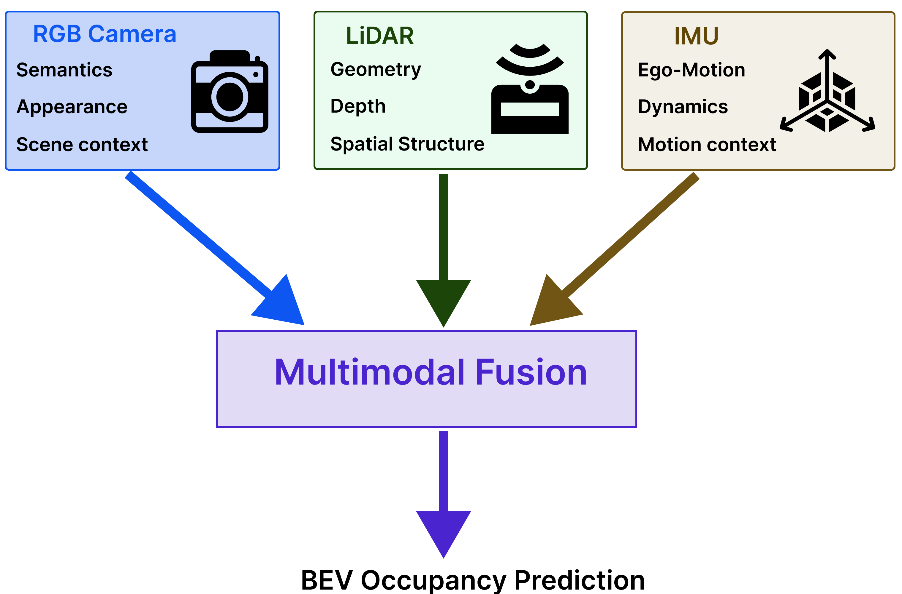
</p>

**Figure 1.** High-level multimodal perception pipeline. RGB, LiDAR BEV, and IMU inputs provide complementary semantic, geometric, and motion cues that are fused to predict BEV occupancy.


The following sections progressively develop the perception system from unimodal baselines to increasingly sophisticated multimodal fusion architectures, followed by comprehensive evaluation, robustness analysis, and deployment benchmarking.

---

## 3. Dataset

### Dataset

This project uses the **nuScenes-mini** dataset, a lightweight subset of the full **nuScenes** autonomous driving benchmark. The dataset contains synchronized multi-sensor recordings collected in real-world urban driving environments, making it well suited for rapid experimentation, systematic model comparison, and benchmarking of multimodal perception systems.

The task is **BEV occupancy prediction**, where the model estimates occupied regions surrounding the ego vehicle by jointly reasoning over synchronized **RGB camera**, **LiDAR**, and **IMU** measurements.

---

### Sensor Modalities

The perception system integrates three complementary sensing modalities.

| Sensor | Role |
|---------|------|
| **RGB Camera** | Captures rich semantic and appearance information, including roads, vehicles, lane markings, buildings, and surrounding infrastructure. |
| **LiDAR** | Provides accurate 3D geometric measurements that are projected into a BEV occupancy representation. |
| **IMU** | Measures vehicle motion through linear acceleration and angular velocity, providing ego-motion context during multimodal fusion. |

Together, these modalities provide complementary semantic, geometric, and motion information for robust scene understanding.

---

### Data Preprocessing Pipeline

Before training, the raw nuScenes recordings are transformed into a unified multimodal dataset optimized for efficient loading during training and evaluation.

```text
Raw nuScenes Dataset
          │
          ▼
   RGB Preprocessing
(BGR → RGB, Resize, Normalize)
          │
          ▼
 LiDAR Point Cloud
          │
          ▼
BEV Occupancy Grid Generation
          │
          ▼
     IMU Extraction
          │
          ▼
  Multimodal HDF5 Dataset
          │
          ▼
 PyTorch Dataset & DataLoader
```

The resulting HDF5 dataset stores synchronized RGB images, BEV occupancy maps, and IMU measurements within each sample, enabling efficient multimodal data loading throughout the training and evaluation pipeline.

---

### Data Preprocessing

#### RGB Camera

Each RGB image is preprocessed by:

- Converting **BGR → RGB**
- Resizing to a fixed spatial resolution
- Normalizing pixel values to **[-1, 1]**
- Rearranging the image layout from **HWC → CHW** for PyTorch

---

#### LiDAR

Each LiDAR point cloud is converted into a BEV occupancy map by:

- Filtering points within the region of interest
- Projecting the 3D point cloud onto the ground plane
- Rasterizing occupied cells into a BEV occupancy grid

This representation provides a compact geometric description of the surrounding environment while preserving spatial occupancy information.

---

#### IMU

For each sample, synchronized IMU measurements are extracted as a fixed-length temporal sequence. During training, the sequence is flattened and encoded by a lightweight Multi-Layer Perceptron (MLP) before being fused with the RGB and LiDAR feature representations.

---

### Representative Dataset Samples

The following examples illustrate representative synchronized multimodal samples from the **nuScenes-mini** dataset. Each sample combines RGB imagery for semantic appearance, LiDAR-derived BEV occupancy for geometric structure, and synchronized IMU measurements for ego-motion information.

<p align="center">
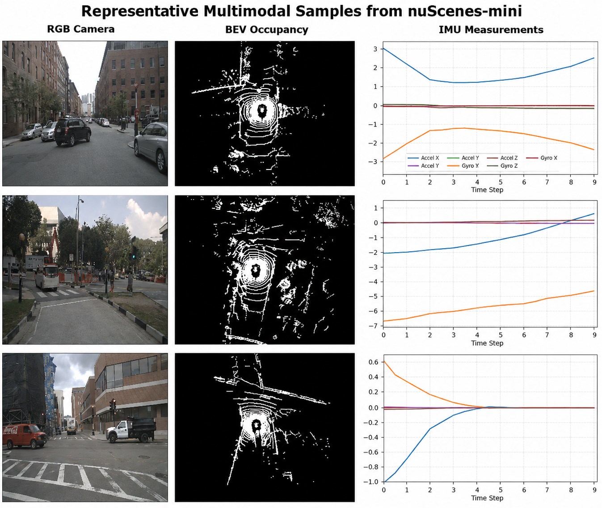
</p>

**Figure 2.** Representative multimodal samples from the **nuScenes-mini** dataset.

These examples highlight the complementary roles of the three sensing modalities:

- **RGB camera:** captures semantic appearance and scene context.
- **LiDAR BEV occupancy:** represents the geometric structure of the surrounding environment.
- **IMU measurements:** provide ego-motion information that complements the visual and geometric features during multimodal fusion.


---

## 4. Repository Structure

The repository is organized into modular components that separate **model development**, **data preparation**, **evaluation**, **deployment**, and **documentation**. This modular structure promotes maintainability, reproducibility, and systematic experimentation while making it straightforward to extend the project with additional multimodal perception architectures.

```text
project3_multimodal_bev_perception/
│
├── assets/                     # Figures and diagrams used in the README
├── checkpoints/                # Trained model checkpoints
├── data/                       # Preprocessed dataset
├── deployment/                 # Exported deployment artifacts
├── notebooks/                  # Phase-by-phase experiments
├── nuscenes/                   # nuScenes SDK
├── reports/                    # Evaluation summaries and benchmark results
├── src/
│   ├── model/
│   │   ├── rgb_baseline.py
│   │   ├── lidar_baseline.py
│   │   ├── fusion_baseline.py
│   │   ├── fusion_cbam.py
│   │   ├── fusion_xattn.py
│   │   └── fusion_hybrid_xattn.py
│   │
│   ├── modules/
│   │   └── cbam.py
│   │
│   ├── dataset_utils.py
│   ├── extract_moving_scenes.py
│   ├── losses.py
│   ├── preprocess_utils.py
│   └── report_utils.py
│
├── README.md
└── Project 3.pptx
```

Experiments were developed incrementally through a sequence of Jupyter notebooks, with each notebook introducing a single architectural enhancement while preserving a consistent training and evaluation pipeline. This incremental workflow enables systematic comparison across all investigated perception architectures.

---

### Directory Overview

| Directory | Purpose |
|-----------|---------|
| **assets/** | Figures, diagrams, plots, and qualitative examples used throughout the README. |
| **checkpoints/** | Saved model checkpoints for trained perception architectures. |
| **data/** | Preprocessed multimodal dataset used for training and evaluation. |
| **deployment/** | Exported deployment artifacts and inference models. |
| **notebooks/** | Phase-by-phase model development, evaluation, robustness analysis, and deployment benchmarking. |
| **nuscenes/** | nuScenes SDK used for dataset loading and processing. |
| **reports/** | Benchmark summaries, evaluation reports, and exported analysis results. |
| **src/model/** | PyTorch implementations of all unimodal and multimodal perception architectures. |
| **src/modules/** | Reusable neural network building blocks, including the CBAM attention module. |
| **src/*.py** | Shared utilities for preprocessing, dataset preparation, loss computation, reporting, and experiment support. |

---

### Design Philosophy

The repository follows a modular engineering workflow in which **data preparation**, **model development**, **training**, **evaluation**, **robustness analysis**, **visualization**, and **deployment** are implemented as independent components. This organization simplifies experimentation, encourages code reuse, and supports the progressive development of increasingly sophisticated multimodal perception architectures while maintaining a consistent evaluation framework.

---

## 5. System & Model Architectures

The proposed perception framework follows a modular **encoder–fusion–decoder** architecture for **BEV occupancy prediction**. Each sensing modality is first encoded independently to learn modality-specific feature representations before being fused into a shared latent representation. A common decoder then reconstructs the final dense BEV occupancy prediction.

This modular design enables progressively advanced multimodal fusion architectures to be investigated while preserving a consistent perception pipeline, allowing fair comparison of prediction accuracy, robustness, computational efficiency, and deployment characteristics.

---

### Overall Architecture

<p align="center">
  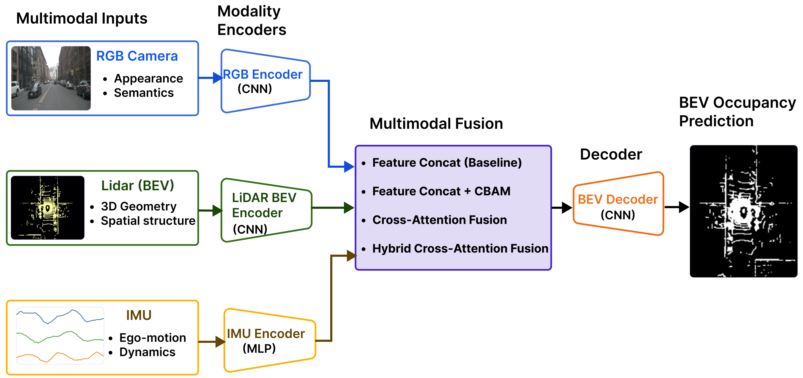
</p>

**Figure 3.** Overall multimodal BEV occupancy prediction architecture. RGB, LiDAR BEV, and IMU features are encoded, fused, and decoded into the final BEV occupancy prediction.

---

### Core Components

#### RGB Encoder

Extracts semantic and appearance features from RGB images.

**Role**

- Scene semantics
- Object appearance
- Texture representation

---

#### LiDAR BEV Encoder

Encodes BEV representations generated from LiDAR point clouds, providing accurate geometric information about the surrounding environment.

**Role**

- Spatial geometry
- Occupancy structure
- Precise localization

---

#### IMU Encoder

Encodes ego-motion measurements into compact motion features that complement the visual and geometric feature representations during multimodal fusion.

**Role**

- Ego-motion awareness
- Motion context
- Complement RGB and LiDAR features

---

#### Fusion Module

The fusion module integrates modality-specific feature representations into a unified latent representation.

Increasingly more sophisticated fusion mechanisms are investigated throughout the project:

- Multimodal Fusion
- Multimodal Fusion + CBAM attention
- Multimodal Cross-attention
- Multimodal Hybrid cross-attention

---

#### Decoder

The decoder progressively upsamples the fused latent representation to reconstruct the full-resolution BEV occupancy map.

---

#### Prediction Head

A lightweight **1×1 convolution** converts decoder features into occupancy logits for every BEV grid cell.

---

### Architecture Evolution

While the overall encoder–fusion–decoder framework remains unchanged, each phase introduces a single architectural enhancement. This incremental design isolates the contribution of each fusion strategy while maintaining a consistent training and evaluation pipeline.

---

### Phase 2 — RGB Baseline

#### RGB Baseline Architecture

<p align="center">
  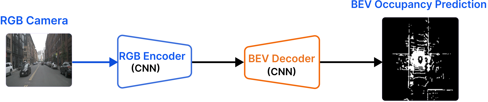
</p>

**Figure 4.** RGB-only baseline architecture for BEV occupancy prediction.

**Idea**

Establish a visual perception baseline using only RGB imagery.

**Key Component**

- CNN-based RGB encoder

**Strengths**

- Strong semantic understanding
- Computationally efficient

**Limitations**

- No explicit geometric information
- Sensitive to lighting and adverse weather

---

### Phase 2B — LiDAR BEV Baseline

#### LiDAR BEV Baseline Architecture

<p align="center">
  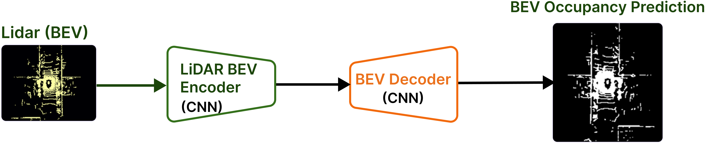
</p>

**Figure 5.** LiDAR BEV baseline architecture for BEV occupancy prediction.

**Idea**

Establish the geometric perception baseline using BEV representations generated from LiDAR point clouds.

**Key Component**

- LiDAR BEV encoder

**Strengths**

- Accurate spatial geometry
- Robust to illumination changes

**Limitations**

- Limited semantic appearance information

---

### Phase 3 — Multimodal Fusion

#### Multimodal Feature Fusion Architecture

<p align="center">
  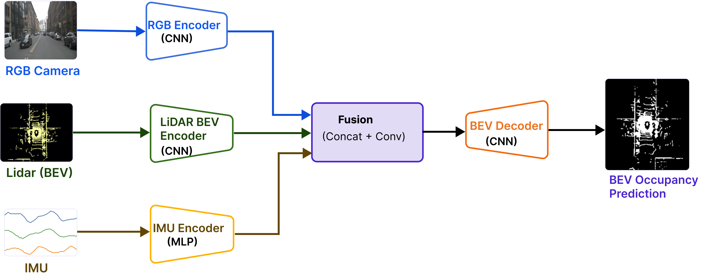
</p>

**Figure 6.** Baseline multimodal fusion architecture using RGB, LiDAR BEV, and IMU features.

**Idea**

Fuse RGB, LiDAR, and IMU feature representations through feature concatenation to establish the first multimodal perception architecture.

**Key Components**

- Feature concatenation
- Fusion convolution

**Strengths**

- Integrates appearance, geometry, and motion information
- Establishes the multimodal baseline

---

### Phase 3B — Multimodal Fusion + CBAM

#### Multimodal Fusion with CBAM Architecture

<p align="center">
  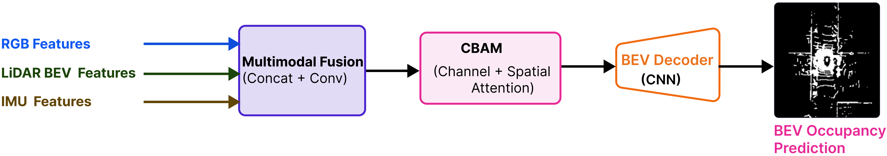
</p>

**Figure 7.** Multimodal Fusion + CBAM architecture with channel and spatial attention.

**Idea**

Introduce the Convolutional Block Attention Module (CBAM) to adaptively emphasize informative feature channels and spatial regions before decoding.

**Key Components**

- Channel attention
- Spatial attention

**Strengths**

- Adaptive feature selection
- Improved multimodal feature representation

---

### Phase 3C — Multimodal Cross-Attention Fusion

#### Multimodal Cross-Attention Fusion Architecture

<p align="center">
  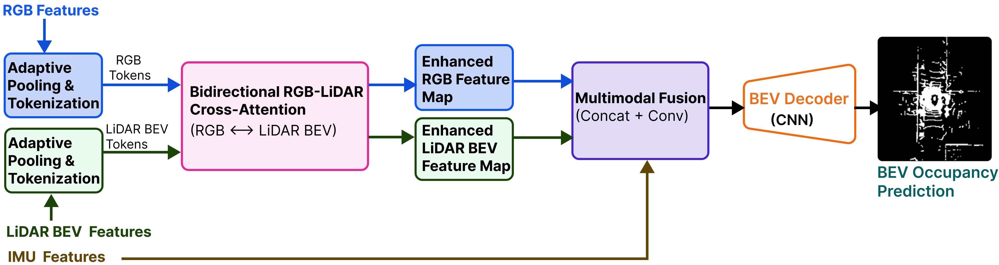
</p>

**Figure 8.** Multimodal Cross-attention fusion architecture enabling interaction between RGB and LiDAR features.

**Idea**

Enable direct interaction between RGB and LiDAR feature representations through Multi-Head Cross-Attention.

**Key Components**

- Multi-Head Cross-Attention
- Scaled Dot-Product Attention

**Strengths**

- Explicit cross-modal reasoning
- Richer multimodal feature interactions

#### Bidirectional Cross-Attention

The bidirectional cross-attention module performs two complementary attention operations to enable mutual information exchange between RGB and LiDAR BEV feature representations. In the first direction, LiDAR BEV features guide the refinement of RGB features by providing geometric context. In the second direction, RGB features guide the refinement of LiDAR BEV features by providing semantic appearance cues. Together, these operations produce enhanced feature representations that capture complementary visual and spatial information before multimodal fusion.

<p align="center">
  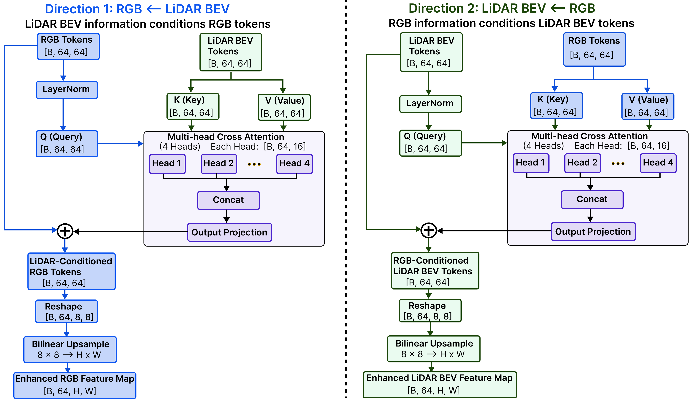
</p>

**Figure 9.** Bidirectional RGB–LiDAR cross-attention module. RGB and LiDAR feature tokens exchange complementary semantic and geometric information through two cross-attention operations before multimodal fusion.

---

### Phase 4 — Multimodal Hybrid Cross-Attention

#### Multimodal Hybrid Cross-Attention Fusion Architecture

<p align="center">
  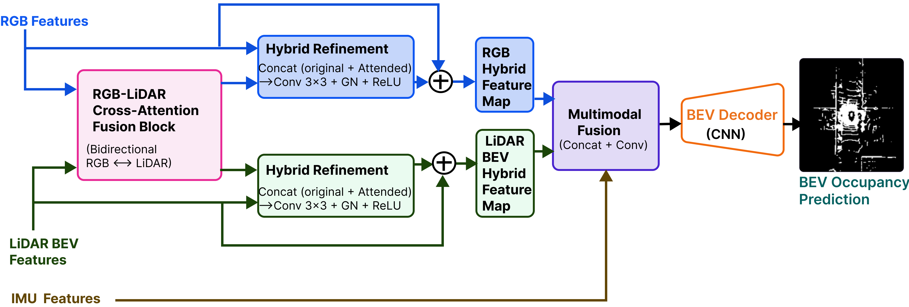
</p>

**Figure 10.** Multimodal Hybrid cross-attention architecture combining residual refinement with bidirectional cross-attention.

**Idea**

Combine original encoder features with cross-attended features through residual refinement, preserving local information while incorporating global multimodal context.

**Key Components**

- Hybrid feature fusion
- Residual refinement

**Strengths**

- Preserves modality-specific information
- Produces the richest multimodal representation investigated in this project

---

### Model Evolution

| Phase | Architecture | Primary Innovation |
|:-----:|--------------|--------------------|
| **2** | RGB Baseline | CNN-based visual perception |
| **2B** | LiDAR BEV Baseline | Geometric BEV perception |
| **3** | Multimodal Fusion | Feature concatenation |
| **3B** | Multimodal Fusion + CBAM | Channel & spatial attention |
| **3C** | Multimodal Cross-Attention Fusion | Cross-modal attention |
| **4** | Multimodal Hybrid Cross-Attention | Residual hybrid fusion |

---

### Design Philosophy

Each phase introduces a single architectural innovation while preserving the same encoder–fusion–decoder framework. This controlled progression enables systematic comparison of multimodal fusion strategies, clearly isolates the contribution of each architectural enhancement, and supports fair evaluation of perception accuracy, robustness, computational efficiency, and deployment readiness.

---

## 6. Training

All perception models are trained using a supervised learning framework for **BEV occupancy prediction** from synchronized RGB camera, LiDAR, and IMU inputs. A common training protocol is maintained across all architectures to ensure fair comparison of the proposed multimodal fusion strategies.

---

### Loss Function

BEV occupancy prediction is formulated as a **dense binary classification** problem, where each BEV grid cell is classified as either **occupied** or **free**.

The network predicts **occupancy logits**, which are optimized using **Binary Cross Entropy with Logits (BCEWithLogitsLoss)**.

**Why BCEWithLogitsLoss?**

- Combines sigmoid activation and binary cross-entropy into a single numerically stable operation
- Eliminates the need for an explicit sigmoid layer during training
- Well suited for dense binary occupancy prediction

During inference, the predicted logits are converted into occupancy probabilities using the sigmoid function before thresholding to generate the final binary occupancy map.

---

### Optimizer

Model parameters are optimized using the **Adam** optimizer, which combines adaptive learning rates with momentum-based optimization.

Key advantages include:

- Fast convergence
- Stable optimization
- Effective training of deep neural networks
- Widely adopted in modern computer vision and perception systems

---

### Learning Rate Scheduling

A learning rate scheduler progressively reduces the learning rate during training, enabling:

- Faster early-stage convergence
- Improved optimization stability
- Better convergence near local optima

---

### Mixed Precision Training

Training uses **Automatic Mixed Precision (AMP)** to improve computational efficiency.

Benefits include:

- Reduced GPU memory usage
- Faster training
- Larger effective batch sizes
- Minimal impact on prediction accuracy

AMP performs most computations using **FP16** while automatically retaining **FP32** precision where numerical stability is required.

---

### Training Configuration

| Component | Configuration |
|-----------|---------------|
| **Loss Function** | BCEWithLogitsLoss |
| **Optimizer** | Adam |
| **Learning Rate Scheduler** | Adaptive learning rate decay |
| **Mixed Precision** | Automatic Mixed Precision (AMP) |
| **Batch Size** | Configurable based on available GPU memory |
| **Epochs** | Fixed across all experiments |

---

### Training Pipeline

Each training iteration follows the standard supervised learning workflow.

```text
Multimodal Dataset
        │
        ▼
Mini-batch Sampling
        │
        ▼
Forward Pass
        │
        ▼
Occupancy Prediction
        │
        ▼
Loss Computation
        │
        ▼
Backpropagation
        │
        ▼
Optimizer Update
        │
        ▼
Checkpoint Saving
```

At the end of each epoch, the model is evaluated on the validation set, and the best-performing checkpoint is retained for subsequent evaluation, robustness analysis, and deployment benchmarking.

---

### Reproducibility

To ensure reproducible experiments:

- Deterministic random seeds are used where applicable
- All architectures share an identical training protocol
- Hyperparameters are managed through configuration files
- Best-performing checkpoints are preserved for evaluation and deployment

Maintaining a consistent training pipeline enables fair comparison across the **RGB Baseline**, **LiDAR BEV Baseline**, **Multimodal Fusion**, **Multimodal Fusion + CBAM**, **Multimodal Cross-Attention Fusion**, and **Multimodal Hybrid Cross-Attention** architectures.

---

## 7. Evaluation

The proposed perception architectures are evaluated from four complementary perspectives:

1. **Prediction Accuracy** – How accurately the model estimates BEV occupancy.
2. **Computational Efficiency** – How efficiently the model performs inference.
3. **Robustness** – How reliably the model performs under sensor degradation and modality failure.
4. **Deployment Readiness** – How easily the trained model can be deployed in production environments.

A common evaluation protocol is maintained across all architectures to enable fair comparison of the **RGB Baseline**, **LiDAR BEV Baseline**, **Multimodal Fusion**, **Multimodal Fusion + CBAM**, **Multimodal Cross-Attention Fusion**, and **Multimodal Hybrid Cross-Attention** models.

---

### Prediction Accuracy

BEV occupancy prediction is formulated as a **dense binary classification** problem and evaluated using the following metrics.

| Metric | Description |
|---------|-------------|
| **Intersection over Union (IoU)** | Measures the overlap between predicted and ground-truth occupied regions. Primary evaluation metric. |
| **Precision** | Fraction of predicted occupied cells that are truly occupied. |
| **Recall** | Fraction of ground-truth occupied cells correctly detected. |
| **F1-score** | Harmonic mean of Precision and Recall. |

---

### Computational Efficiency

In addition to prediction accuracy, real-world perception systems must satisfy strict runtime constraints.

| Metric | Description |
|---------|-------------|
| **Latency** | End-to-end inference time per sample (ms). Lower is better. |
| **Frames Per Second (FPS)** | Number of samples processed per second during real-time inference. Higher is better. |
| **Throughput** | Number of samples processed per second using larger inference batches. |
| **Peak GPU Memory** | Maximum GPU memory allocated during inference. |

Together, these metrics characterize the trade-off between perception accuracy and computational efficiency.

---

### Robustness

To evaluate deployment reliability, the strongest-performing architectures are additionally benchmarked under simulated sensor degradations, including:

- Camera blur
- LiDAR sparsification
- IMU bias and drift
- RGB camera dropout
- LiDAR dropout

Performance degradation is quantified using the same prediction metrics, while representative worst-case examples are analyzed through qualitative failure visualization.

A detailed robustness benchmark is presented in **Section 10 – Robustness & Failure Analysis**.

---

### Deployment Readiness

Deployment readiness is evaluated by exporting trained models to production-friendly formats.

| Format | Purpose |
|--------|---------|
| **TorchScript** | Native PyTorch deployment and optimized inference. |
| **ONNX** | Framework-independent deployment across multiple inference engines. |

A detailed discussion of deployment optimization and model export is presented in **Section 11 – Deployment & Engineering**.

---

### Evaluation Workflow

```text
Trained Model
      │
      ▼
Validation Dataset
      │
      ▼
Inference
      │
      ▼
Accuracy
    • IoU
    • Precision
    • Recall
    • F1

Efficiency
    • GPU Latency
    • GPU Memory

Robustness
    • Sensor Perturbations
    • Failure Analysis
```

This workflow summarizes the three complementary aspects of the evaluation protocol: prediction accuracy, computational efficiency, and robustness to sensor degradation.


---

### Evaluation Summary

Every perception architecture is evaluated using a unified benchmark protocol designed to answer four fundamental questions:

- **How accurate** is the BEV occupancy prediction?
- **How efficient** is the model during inference?
- **How robust** is the model to sensor degradation?
- **How suitable** is the model for real-world deployment?

This standardized evaluation framework enables comprehensive comparison of all proposed perception architectures while ensuring that improvements in prediction accuracy are considered alongside computational efficiency, robustness, and deployment readiness.

The following sections present quantitative results, ablation studies, robustness evaluation, and deployment benchmarking.

---

## 8. Results

The proposed perception architectures are evaluated using a unified benchmark that measures both **prediction accuracy** and **computational efficiency**. Each successive architecture introduces a single architectural enhancement while preserving a common training and evaluation pipeline.

The results highlight the trade-offs between perception accuracy, computational efficiency, and deployment readiness.

---

### Quantitative Performance

#### Overall Performance Comparison

<p align="center">
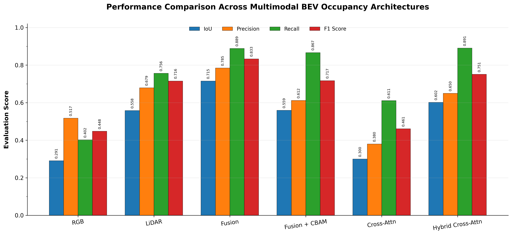
</p>

**Figure 11.** Performance comparison of all six BEV occupancy prediction architectures.


| Architecture | IoU ↑ | Precision ↑ | Recall ↑ | F1 Score ↑ |
|:-------------|------:|------------:|----------:|-----------:|
| RGB Baseline | 0.2909 | 0.5175 | 0.4019 | 0.4479 |
| LiDAR BEV Baseline | 0.5577 | 0.6793 | 0.7562 | 0.7155 |
| **Multimodal Fusion** | **0.7150** | **0.7847** | 0.8887 | **0.8333** |
| Multimodal Fusion + CBAM | 0.5592 | 0.6116 | 0.8667 | 0.7170 |
| Multimodal Cross-Attention Fusion | 0.3000 | 0.3796 | 0.6111 | 0.4609 |
| Multimodal Hybrid Cross-Attention | 0.6017 | 0.6497 | **0.8906** | 0.7511 |

> **Key Findings**
>
> - **Multimodal Fusion** achieved the highest overall **IoU**, **Precision**, and **F1 Score**, demonstrating the strongest overall perception performance.
> - **Multimodal Hybrid Cross-Attention** achieved the highest **Recall**, indicating improved sensitivity to occupied regions.
> - The attention-based architectures did not consistently outperform the simpler **Multimodal Fusion** baseline, illustrating that increased architectural complexity does not necessarily translate into better overall BEV occupancy prediction performance.

---

### Qualitative Results

While quantitative metrics summarize overall model performance, they do not reveal **where** predictions succeed or fail. To complement the numerical evaluation, representative validation scenes are visualized using synchronized RGB camera images, ground-truth BEV occupancy maps, predicted occupancy maps, and binary error maps.

<p align="center">
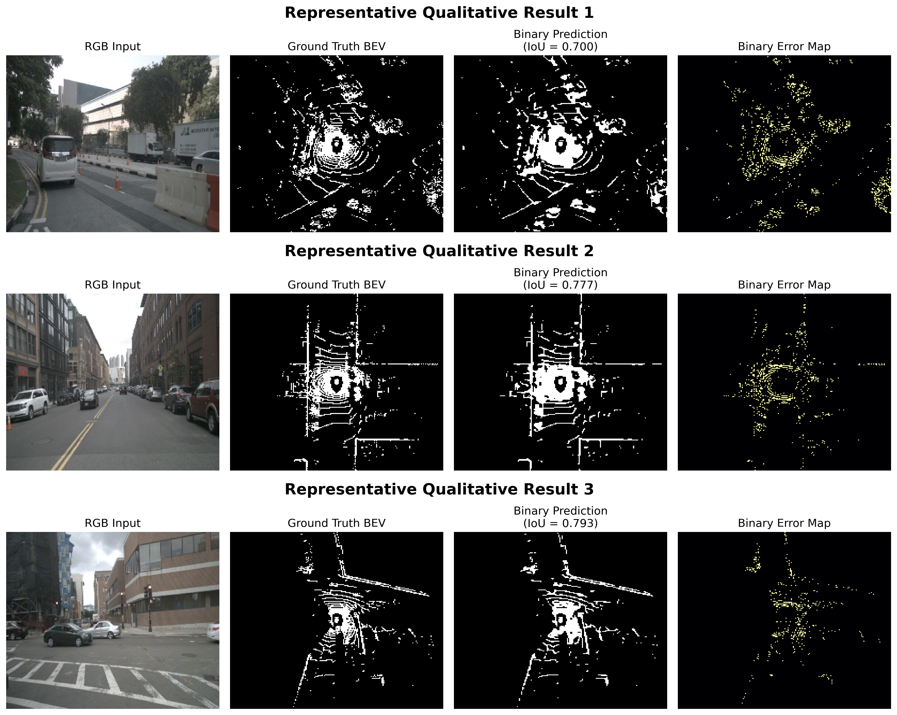
</p>

**Figure 12.** Qualitative predictions from the **Multimodal Fusion** model. Each row shows the RGB camera input, ground-truth BEV occupancy map, predicted occupancy map, and the corresponding binary error map, highlighting regions where the prediction differs from the ground truth.

These examples demonstrate the model's ability to capture scene geometry and free-space occupancy across diverse urban driving environments, including:

- Urban intersections
- Curved roads
- Dense traffic
- Sparse environments
- Challenging nighttime conditions

The qualitative results complement the quantitative evaluation by showing that the proposed multimodal fusion approach produces spatially consistent occupancy predictions while localizing most errors to complex scene boundaries and fine structural details.

---

### Summary of Findings

The experimental results demonstrate several important observations:

- **Multimodal Fusion** substantially outperforms both unimodal baselines by combining complementary semantic, geometric, and motion information.
- **Multimodal Fusion + CBAM attention** improves feature selection through adaptive channel and spatial attention.
- **Multimodal Cross-attention Fusion** enables richer interactions between RGB and LiDAR feature representations.
- **Multimodal Hybrid Cross-Attention** achieves the highest recall by combining cross-modal attention with residual feature fusion.
- The strongest-performing architectures provide an effective balance between perception accuracy and real-time inference performance.

Additional analyses of **robustness under sensor degradation**, **qualitative failure cases**, and **deployment benchmarking** are presented in the following sections.

---

## 9. Ablation Studies

To quantify the contribution of each sensing modality and fusion strategy, a series of ablation experiments were conducted. Each experiment modifies a single component while keeping the remaining training configuration unchanged, allowing the impact of individual design choices to be evaluated in isolation.

---

### Sensor Ablation

The first set of experiments evaluates the contribution of each sensing modality by progressively expanding the perception pipeline.

| Configuration | IoU ↑ | Precision ↑ | Recall ↑ | F1 ↑ |
|:--------------|------:|------------:|----------:|------:|
| RGB Baseline | 0.2909 | 0.5175 | 0.4019 | 0.4479 |
| LiDAR BEV Baseline | 0.5577 | 0.6793 | 0.7562 | 0.7155 |
| **Multimodal Fusion (RGB + LiDAR + IMU)** | **0.7150** | **0.7847** | **0.8887** | **0.8333** |

#### Key Observations

- **RGB Baseline** establishes the visual perception baseline but is limited by the absence of explicit geometric information, resulting in the lowest overall occupancy prediction performance.
- **LiDAR BEV Baseline** substantially improves prediction accuracy by providing accurate geometric representations of the surrounding environment, demonstrating the importance of spatial information for BEV occupancy prediction.
- **Multimodal Fusion** achieves the strongest overall performance by integrating complementary appearance, geometry, and ego-motion information into a unified feature representation.
- In these experiments, the RGB + LiDAR + IMU fusion model substantially outperformed both unimodal baselines. 

---

### Fusion Ablation

The second set of experiments compares progressively advanced multimodal fusion strategies while keeping the encoder–fusion–decoder framework unchanged.

| Fusion Strategy | IoU ↑ | Precision ↑ | Recall ↑ | GPU FPS ↑ |
|:----------------|------:|------------:|----------:|----------:|
| **Multimodal Fusion** | **0.7150** | **0.7847** | 0.8887 | **389.89** |
| Multimodal Fusion + CBAM | 0.5592 | 0.6116 | 0.8667 | — |
| Multimodal Cross-Attention Fusion | 0.3000 | 0.3796 | 0.6111 | — |
| Multimodal Hybrid Cross-Attention | 0.6017 | 0.6497 | **0.8906** | 258.18 |

> **Note:** GPU FPS was benchmarked only for the two deployment candidates—**Multimodal Fusion** and **Multimodal Hybrid Cross-Attention**.

#### Key Observations

- **Multimodal Fusion** achieved the strongest overall performance, providing the highest IoU, Precision, F1-score, and the fastest inference speed among the evaluated architectures.
- **Multimodal Fusion + CBAM** improved feature selection through attention but did not improve overall occupancy prediction on this dataset.
- **Multimodal Cross-Attention Fusion** introduced substantially greater architectural complexity but did not outperform the simpler Multimodal Fusion architecture, illustrating that increased model complexity does not necessarily translate into better performance.
- **Multimodal Hybrid Cross-Attention** recovered much of the performance lost by the standard Cross-Attention architecture and achieved the highest recall, although it remained less accurate and less computationally efficient than Multimodal Fusion.

---

### Discussion

The ablation studies provide several important insights into multimodal perception.

#### Sensor Contribution

- Combining multiple sensing modalities consistently improves prediction accuracy over unimodal perception.
- LiDAR provides complementary geometric information that substantially improves spatial understanding.
- IMU contributes ego-motion information that complements the visual and geometric representations during multimodal fusion.

#### Fusion Strategy

- **Multimodal Fusion** establishes a strong multimodal baseline through simple feature concatenation.
- **Multimodal Fusion + CBAM attention** improves feature selection by emphasizing informative channels and spatial regions but does not improve overall prediction accuracy on this dataset.
- **Multimodal Cross-attention Fusion** enables richer interaction between sensor representations but introduces additional architectural complexity.
- **Multimodal Hybrid Cross-Attention** combines residual feature fusion with cross-modal attention, achieving the highest recall while partially recovering the performance of the simpler Multimodal Fusion architecture.

Overall, the ablation studies demonstrate that **sensor diversity provides the largest performance gains**, while increasingly sophisticated fusion mechanisms introduce important trade-offs between prediction accuracy, computational complexity, and deployment efficiency.


---


## 10. Robustness & Failure Analysis

To evaluate model robustness under realistic sensor failures, the strongest-performing perception architectures were benchmarked under multiple simulated sensor degradation scenarios. The objective was to quantify robustness to imperfect sensor inputs and identify representative failure modes likely to occur in real-world autonomous driving systems.


**Only the model inputs were perturbed**. The ground-truth occupancy map remained unchanged throughout evaluation, ensuring that all performance degradation originated solely from degraded sensor observations.

---

### Evaluated Sensor Perturbations

| Perturbation | Description |
|--------------|-------------|
| **Normal** | Clean sensor inputs |
| **Camera Blur** | Average-filter blur applied to RGB images |
| **LiDAR Sparsification** | Random removal of occupied BEV cells |
| **IMU Bias + Drift** | Persistent per-channel bias with Gaussian measurement noise |
| **RGB Dropout** | Complete camera failure (black image) |
| **LiDAR Dropout** | Complete LiDAR failure (empty BEV) |

Before benchmarking, each perturbation was verified both quantitatively and visually to ensure that only the intended sensor modality was affected.

<p align="center">

</p>

**Figure 13.** Simulated sensor perturbations used during robustness evaluation.


<p align="center">
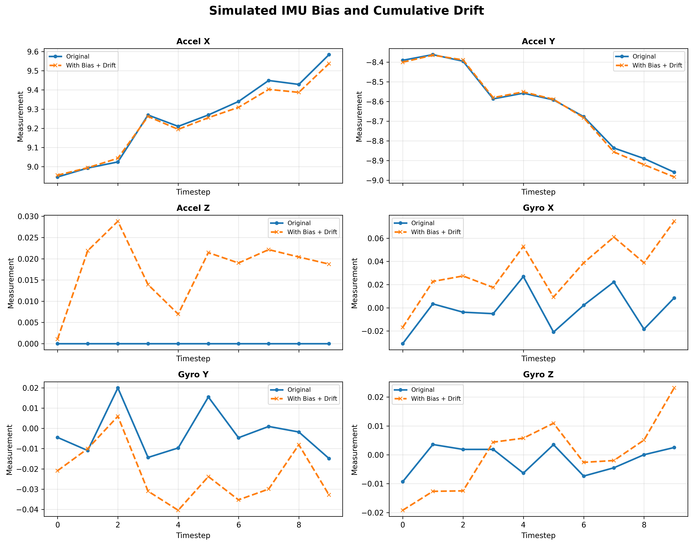
</p>

**Figure 14.** Simulated IMU bias and cumulative drift across accelerometer and gyroscope channels.

---

### Evaluation Metrics

Performance was evaluated using binary occupancy prediction metrics:

- **Intersection over Union (IoU)**
- **Precision**
- **Recall**
- **F1-score**

Metrics were computed for every validation sample and averaged across the validation set.

---

### Robustness Results

| Model | Clean IoU | Largest Performance Drop |
|--------|----------:|-------------------------:|
| **Multimodal Fusion** | **0.7038** | LiDAR Dropout (-99.66%) |
| **Multimodal Hybrid Cross-Attention** | **0.6017** | LiDAR Dropout (-99.76%) |

**Note:** Robustness experiments use a fixed held-out 20% subset of the sorted dataset for reproducible perturbation testing. This differs from the randomly sampled validation split used during the original model evaluation, resulting in a slightly different clean-reference IoU (0.7038 vs. 0.7150).

#### Key Observations

- Camera blur produced only negligible performance degradation.
- IMU Bias + Drift had minimal impact, indicating robustness to modest IMU measurement errors.
- LiDAR sparsification caused a moderate decrease in occupancy prediction accuracy.
- Complete LiDAR failure resulted in nearly complete performance collapse for both architectures, highlighting the dominant role of LiDAR in BEV occupancy estimation.

---

### Relative IoU Degradation

| Model | Condition | Relative Δ IoU |
|--------|-----------|---------------:|
| **Multimodal Fusion** | Camera Blur | -0.09% |
| **Multimodal Fusion** | LiDAR Sparsification | -26.28% |
| **Multimodal Fusion** | IMU Bias + Drift | ~0% |
| **Multimodal Fusion** | RGB Dropout | -0.22% |
| **Multimodal Fusion** | LiDAR Dropout | -99.66% |
| **Multimodal Hybrid Cross-Attention** | Camera Blur | -0.03% |
| **Multimodal Hybrid Cross-Attention** | LiDAR Sparsification | -14.92% |
| **Multimodal Hybrid Cross-Attention** | IMU Bias + Drift | ~0% |
| **Multimodal Hybrid Cross-Attention** | RGB Dropout | +0.18% |
| **Multimodal Hybrid Cross-Attention** | LiDAR Dropout | -99.76% |

<p align="center">
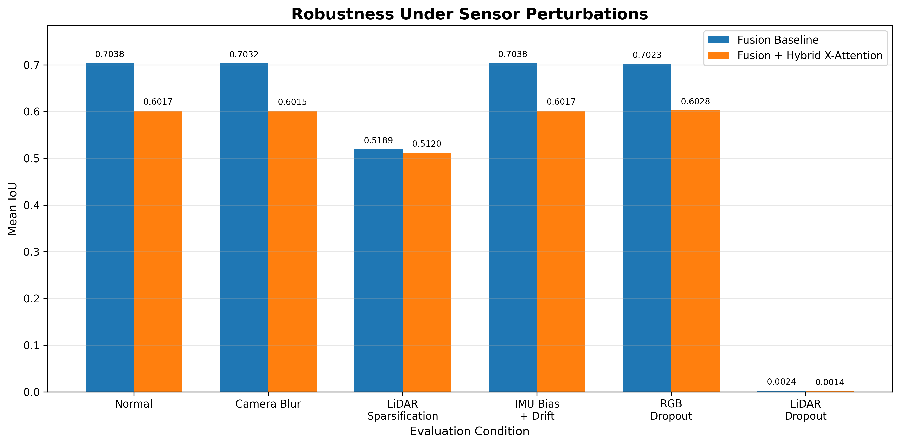
</p>

**Figure 15.** Mean IoU under simulated sensor perturbations.

---

### Failure Analysis

While aggregate metrics quantify overall robustness, they do not explain *where* prediction errors occur. To better understand model behavior, representative worst-case validation samples were automatically selected based on the largest IoU degradation under severe LiDAR perturbations.

Each failure case visualizes:

- RGB input
- Clean LiDAR BEV
- Perturbed LiDAR BEV
- Ground-truth occupancy
- Prediction under clean inputs
- Prediction under perturbed inputs
- Absolute prediction error

<p align="center">
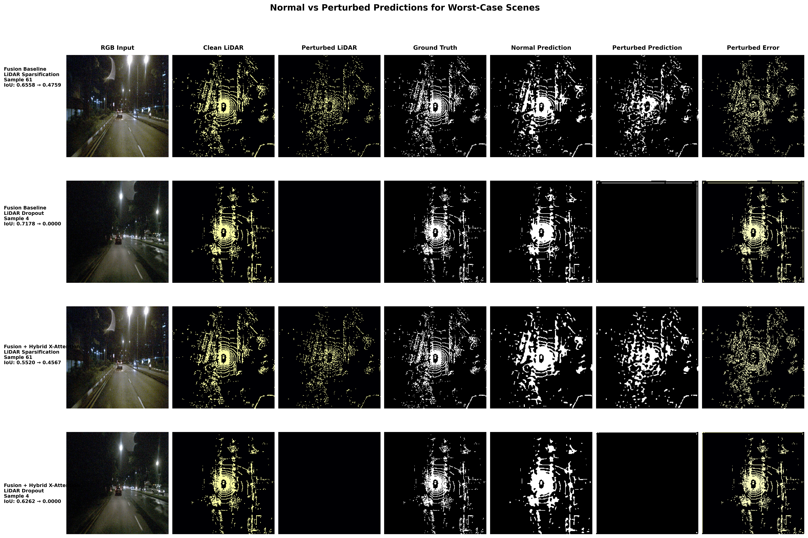
</p>

**Figure 16.** Representative failure cases under severe **LiDAR perturbations**.

The qualitative analysis complements the quantitative benchmark by revealing *where* prediction errors occur rather than only *how much* overall accuracy degrades.

---

## 11. Deployment & Engineering

Beyond prediction accuracy, practical perception systems must satisfy real-world deployment requirements, including low inference latency, efficient memory usage, portability, and reproducibility. Accordingly, the strongest-performing architectures were evaluated not only as research prototypes but also as deployable perception systems.

The deployment analysis compares model complexity, inference performance, resource utilization, and deployment portability to assess the engineering trade-offs associated with different multimodal fusion architectures.

---

### Model Statistics

The two deployment candidates selected after quantitative evaluation were further analyzed in terms of model complexity, estimated model size, and peak GPU memory consumption during inference.

| Model | Parameters | Model Size (MB) | Peak GPU Memory (MB) |
|:------|-----------:|----------------:|---------------------:|
| **Multimodal Fusion** | **364,913** | **1.39** | **90.33** |
| **Multimodal Hybrid Cross-Attention** | **546,161** | **2.08** | **95.43** |

> **Note:** Detailed deployment profiling was performed only for the two architectures selected as deployment candidates following the quantitative evaluation. The remaining models were compared using the prediction metrics presented in the **Results** and **Ablation Studies** sections.

---

### Model Size Estimation

The approximate model size is estimated assuming **FP32** parameters:

**Model Size (MB) = (Number of Parameters × 4) / 1024²**

where:

- **Number of Parameters** = total trainable parameters
- **4** = bytes per FP32 parameter
- **1024²** = bytes per megabyte (1,048,576 bytes)

> **Note:** This estimate accounts only for the model parameters and excludes optimizer states, gradients, and intermediate activation tensors during training.

---

### Latency Benchmark

Real-time perception systems require low inference latency to support responsive decision-making. Following the quantitative evaluation, the two deployment candidates were benchmarked on both CPU and GPU.

| Model | CPU Latency (ms) ↓ | GPU Latency (ms) ↓ |
|:------|-------------------:|-------------------:|
| **Multimodal Fusion** | **64.69** | **2.56** |
| **Multimodal Hybrid Cross-Attention** | **68.84** | **3.87** |

> **Note:** Latency benchmarking was performed only for the two deployment candidates.

Lower inference latency enables faster perception updates, improving responsiveness for real-time autonomous driving and robotics applications.

---

### GPU Latency Comparison

Real-time perception systems require both high prediction accuracy and low inference latency. To assess deployment efficiency, the two strongest-performing architectures were benchmarked under identical GPU hardware conditions.

<p align="center">
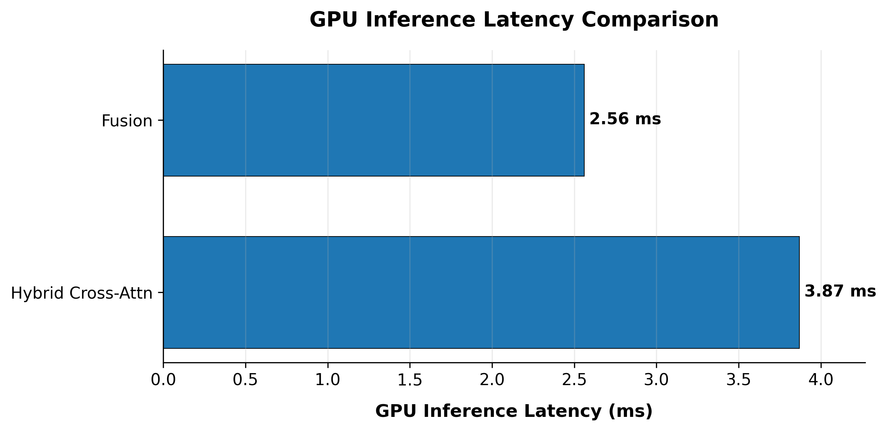
</p>

**Figure 17.** GPU inference latency comparison for the deployment candidates.

The **Multimodal Fusion** model achieves **2.56 ms** GPU inference latency, while **Multimodal Hybrid Cross-Attention** requires **3.87 ms**, corresponding to approximately **51% higher latency** due to the additional computational cost of the cross-attention mechanism. Despite this overhead, both models remain suitable for real-time deployment.

---

### Model Export

#### TorchScript

Each trained model is exported to **TorchScript**, PyTorch's native deployment format. TorchScript serializes both the computation graph and learned parameters into a standalone representation that supports efficient inference without requiring the original Python model definition.

**Advantages**

- Native PyTorch deployment
- C++ inference support
- Reduced Python runtime overhead
- Production-ready model serialization

---

#### ONNX

Models are also exported to the **Open Neural Network Exchange (ONNX)** format, enabling framework-independent deployment across multiple inference engines.

Supported deployment targets include:

- ONNX Runtime
- NVIDIA TensorRT
- Intel OpenVINO
- Microsoft DirectML
- Other hardware-optimized inference frameworks

ONNX improves deployment portability while enabling hardware-specific inference optimization.

---

### Deployment Pipeline

<p align="center">
  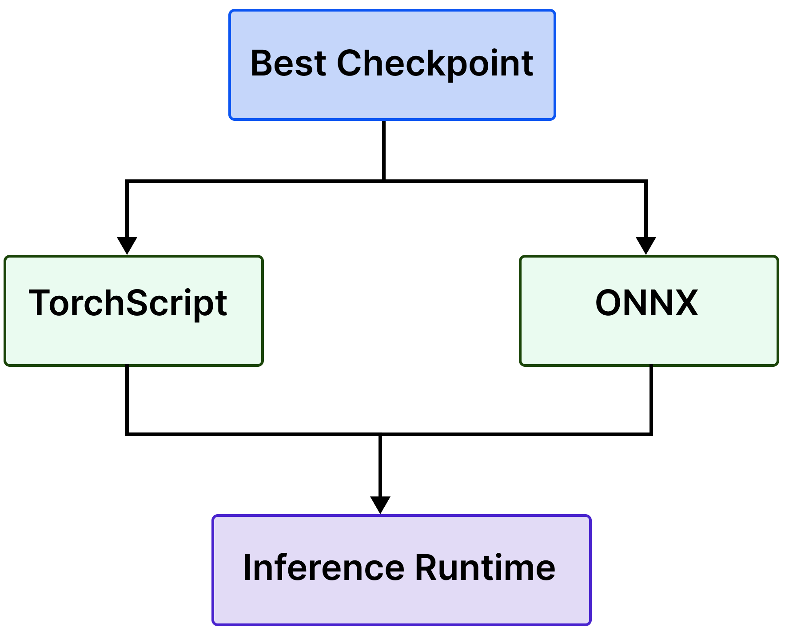
</p>

**Figure 18.** Deployment workflow. The best trained checkpoint is exported to both TorchScript and ONNX formats, enabling deployment through a common inference runtime.

---

### Engineering Trade-offs

The deployment benchmarks reveal several practical engineering trade-offs:

- **Multimodal Fusion** provides the strongest balance between prediction accuracy and computational efficiency.
- Attention-based architectures introduce additional representational capacity but also increase computational cost.
- **Multimodal Hybrid Cross-Attention** achieves the highest recall but requires more parameters, higher memory usage, and longer inference latency.
- Increasing architectural complexity does not necessarily improve overall perception performance, emphasizing the importance of empirical evaluation rather than architectural sophistication alone.

---

### Deployment Summary

Deployment benchmarks indicate that **Multimodal Fusion** provides the best balance between prediction accuracy, inference speed, model size, and GPU memory usage, making it the preferred deployment candidate for the **nuScenes-mini** benchmark.

| Objective | Recommended Model |
|-----------|-------------------|
| **Best Accuracy** | **Multimodal Fusion** |
| **Fastest Inference** | **Multimodal Fusion** |
| **Best Overall Trade-off** | **Multimodal Fusion** |

Although the attention-based architectures introduce more sophisticated fusion mechanisms, they also increase computational complexity without improving overall performance on the **nuScenes-mini** benchmark. These results highlight an important engineering insight: **architectural complexity does not necessarily translate into better real-world performance.**

Overall, this deployment analysis extends beyond algorithm development by incorporating practical engineering considerations—including latency profiling, memory benchmarking, model serialization, and cross-platform deployment—to provide a comprehensive assessment of production readiness for modern multimodal perception systems.

---

## 12. Future Work

The perception architectures developed in this project establish a modular foundation for multimodal BEV occupancy prediction. Future work will focus on improving temporal reasoning, perception accuracy, deployment efficiency, and large-scale evaluation.

---

### Temporal Sensor Fusion

The current models process each synchronized sensor observation independently. Future work could exploit temporal information across consecutive frames to better capture scene dynamics, object motion, and temporal consistency.

Potential directions include:

- Temporal feature aggregation
- Recurrent neural networks (RNN/LSTM)
- Temporal attention mechanisms
- Spatio-temporal transformers

---

### Modern BEV Perception Architectures

Recent autonomous driving systems increasingly employ transformer-based and BEV-centric perception architectures. Future work will investigate modern perception frameworks such as:

- BEVFormer
- BEVFusion
- BEVDet
- Multi-camera BEV perception

These architectures provide natural benchmarks against the CNN-based perception models developed in this project while enabling richer global spatial reasoning.

---

### Deployment Optimization

Although the current models support **TorchScript** and **ONNX** export, additional deployment optimizations could further improve real-time inference performance.

Potential directions include:

- NVIDIA TensorRT
- Operator fusion
- Dynamic batching
- Hardware-specific inference optimization

Model compression techniques such as **FP16 inference**, **INT8 quantization**, **structured pruning**, and **knowledge distillation** may further reduce latency, memory consumption, and deployment cost while maintaining prediction accuracy.

---

### Large-Scale Benchmarking

This project uses **nuScenes-mini** to enable rapid experimentation and systematic comparison of multiple multimodal fusion architectures.

A natural next step is to train and evaluate the strongest-performing architectures on the **full nuScenes benchmark**, enabling:

- Improved model generalization
- Large-scale performance evaluation
- Comparison with published state-of-the-art methods
- More comprehensive robustness and failure analysis

---

### Closing Remarks

This project demonstrates a complete engineering workflow for multimodal autonomous perception—from data preparation and model development to quantitative evaluation, robustness benchmarking, failure analysis, and deployment engineering. The modular encoder–fusion–decoder framework provides a flexible foundation for future research while remaining practical for real-world deployment. Future extensions can build upon this framework by incorporating temporal perception, transformer-based architectures, deployment optimization, and large-scale benchmarking.

---

## 13. Key Takeaways

This project demonstrates:

- End-to-end multimodal BEV occupancy prediction using synchronized RGB camera, LiDAR, and IMU data.
- Progressive development from unimodal baselines to advanced multimodal perception architectures.
- Systematic comparison of multiple multimodal fusion strategies.
- Comprehensive quantitative evaluation using IoU, Precision, Recall, and F1-score.
- Robustness benchmarking under simulated sensor degradation and modality dropout.
- Qualitative failure analysis through representative worst-case examples.
- Deployment benchmarking, including latency, throughput, GPU memory usage, and model size.
- Production-oriented model export using TorchScript and ONNX.

---

Overall, this project demonstrates a complete engineering workflow for multimodal autonomous perception—from data preparation and model development to quantitative evaluation, robustness analysis, deployment engineering, and model export. The resulting modular perception framework provides a reproducible foundation for future research while illustrating the practical trade-offs between perception accuracy, computational efficiency, robustness, and deployment readiness in modern autonomous driving systems.

---