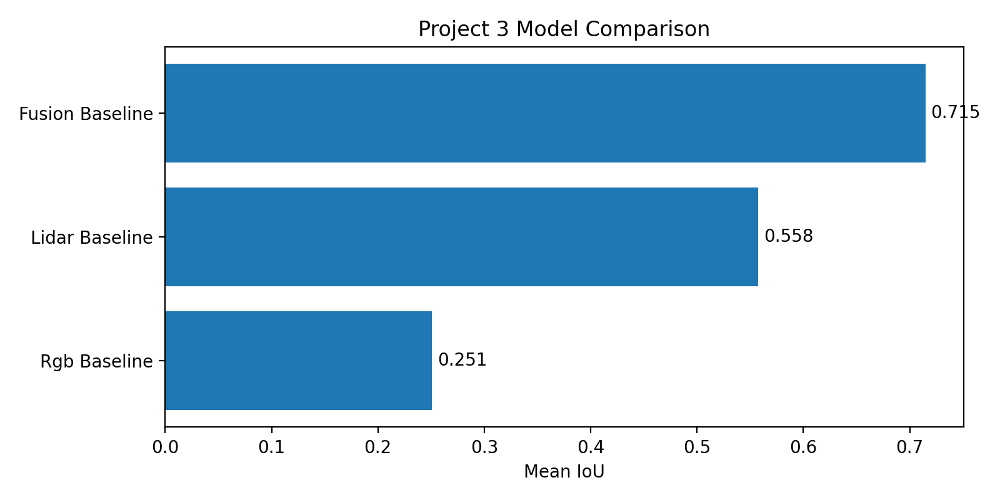

# Project 3 Results Overview

## Quantitative Comparison

| Model           |   Mean IoU |
|:----------------|-----------:|
| Fusion Baseline |   0.714957 |
| Lidar Baseline  |   0.557718 |
| Rgb Baseline    |   0.250902 |

## Model Comparison

## Summary

- Best-performing model: **Fusion Baseline** (Mean IoU = 0.715)
- Total evaluated models: **3**
